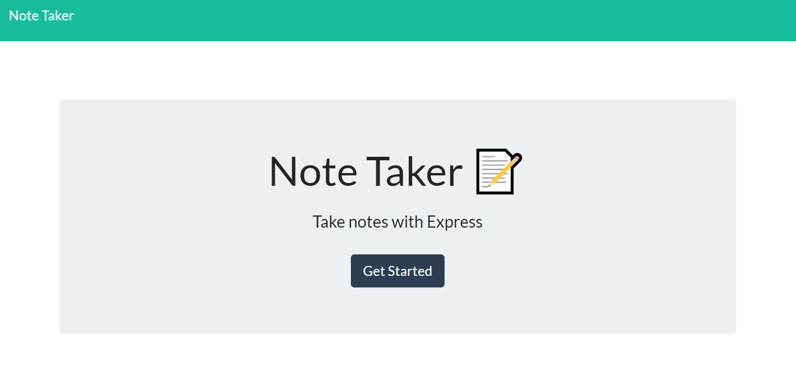

# NoteTaker

Goal:  to create an application to write, save and delete notes while using an express backend and retrieving note data from a JSON file.

## Description

This application had HTML routes that were created to return the index.html and notes.html files using GET. A db.json file is used on the backend to store any notes made and retrieve them using the fs module.

There are three API routes used: the first is GET /api/notes, the second is POST /api/notes, and the third is DELETE /api/notes/:id. GET reads the db.json file and returns all notes in JSON format. The POST takes the new note and adds it to the db.json file while returning it to the user.

Below is the link for the deployed application:

[Note Taker](https://magrimes.github.io/NoteTaker/index.html)

## Code Style

The following code styles are used in the application:

* HTML

* CSS

* JavaScript

* JSON

* Express

* Node.js  

## Screenshots

Below displays the running application:

* Home Page

* Notes Page

* Notes Page with Saved Notes

## Credits

Rewatching class videos and going over previous activities helped with the completion of the homework, and a few questions were answered with the help of classmates and TAs in the classroom.

## License

MIT License

Copyright (c) [2019] [Meredith Grimes]

Permission is hereby granted, free of charge, to any person obtaining a copy of this software and associated documentation files (the "Software"), to deal in the Software without restriction, including without limitation the rights to use, copy, modify, merge, publish, distribute, sublicense, and/or sell copies of the Software, and to permit persons to whom the Software is furnished to do so, subject to the following conditions:The above copyright notice and this permission notice shall be included in all copies or substantial portions of the Software.

THE SOFTWARE IS PROVIDED "AS IS", WITHOUT WARRANTY OF ANY KIND, EXPRESS OR IMPLIED, INCLUDING BUT NOT LIMITED TO THE WARRANTIES OF MERCHANTABILITY, FITNESS FOR A PARTICULAR PURPOSE AND NONINFRINGEMENT. IN NO EVENT SHALL THE AUTHORS OR COPYRIGHT HOLDERS BE LIABLE FOR ANY CLAIM, DAMAGES OR OTHER LIABILITY, WHETHER IN AN ACTION OF CONTRACT, TORT OR OTHERWISE, ARISING FROM, OUT OF OR IN CONNECTION WITH THE SOFTWARE OR THE USE OR OTHER DEALINGS IN THE SOFTWARE.